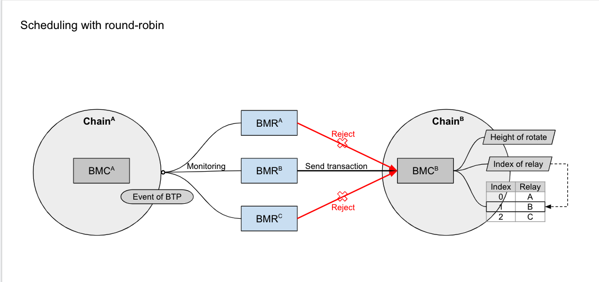
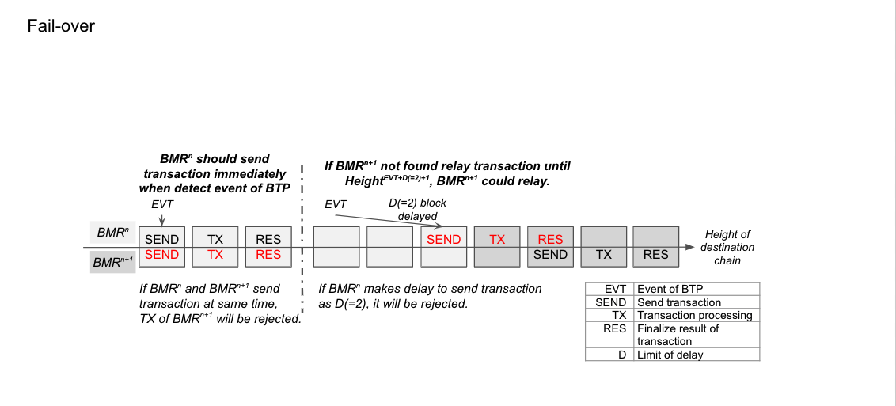

# Smart Contracts Configuration

In this example, we would like to show how to config to setup a connection between ICON and Moonriver networks. For other cases, there might be a different configuration

**Attention:** This configuration step must be executed after completely deploying smart contracts \(BSH, BMC, and BMV\) on both connecting networks and generating keystore files of both BTP Message Relays \(BMRs\)

## 1. ICON-BMC Configuration

### Generate Owner and Register Owner of BMC

```bash
cd $PROJECT_DIR/btp

# Replace YOUR_PASSWORD if needed
YOUR_PASSWORD=1234

goloop ks gen --out $CONFIG_DIR/bmc-owner.json --password $YOUR_PASSWORD

# Create a secret file 'bmc-owner.secret' and save $YOUR_PASSWORD into that file
echo -n $YOUR_PASSWORD > $CONFIG_DIR/bmc-owner.secret

# Save bmc-owner address to a file
echo $(jq -r '.address' "$CONFIG_DIR/bmc-owner.json") > $CONFIG_DIR/bmc-owner.addr

# Register Owner
goloop rpc --uri http://127.0.0.1:9080/api/v3/icon sendtx call --to $(cat $CONFIG_DIR/bmc.icon) \
    --key_store $CONFIG_DIR/goloop.keystore.json \
    --key_password $(cat $CONFIG_DIR/goloop.keysecret) \
    --nid $(cat $CONFIG_DIR/nid.icon) \
    --step_limit 13610920001 \
    --method addOwner \
    --param _addr=$(cat $CONFIG_DIR/bmc-owner.addr) \
    | jq -r . > $CONFIG_DIR/tx.addBMCOwner.icon
# Also check whether this transaction is successful 
# goloop rpc --uri http://127.0.0.1:9080/api/v3/icon txresult $(cat $CONFIG_DIR/tx.addBMCOwner.icon)
# If fail, it shows error message and status '0x0'
# Otherwise, status '0x1


# Add funds to BMC-Owner
AMOUNT=1000000000000000000000000
goloop rpc --uri http://127.0.0.1:9080/api/v3/icon sendtx transfer \
    --to $(cat $CONFIG_DIR/bmc-owner.addr) --value $AMOUNT \
    --key_store $CONFIG_DIR/goloop.keystore.json \
    --key_password $(cat $CONFIG_DIR/goloop.keysecret) \
    --nid $(cat $CONFIG_DIR/nid.icon) \
    --step_limit 10000000000 | jq -r . > $CONFIG_DIR/tx.bmcOwner.addFund
# Also check whether this transaction is successful 
# goloop rpc --uri http://127.0.0.1:9080/api/v3/icon txresult $(cat $CONFIG_DIR/tx.bmcOwner.addFund)
# If fail, it shows error message and status '0x0'
# Otherwise, status '0x1
```

### Add **BMV**

```bash
goloop rpc --uri http://127.0.0.1:9080/api/v3/icon sendtx call --to $(cat $CONFIG_DIR/bmc.icon) \
    --key_store $CONFIG_DIR/bmc-owner.json \
    --key_password $(cat $CONFIG_DIR/bmc-owner.secret) \
    --nid $(cat $CONFIG_DIR/nid.icon) \
    --step_limit 13610920001 \
    --method addVerifier \
    --param _net=$(cat $CONFIG_DIR/net.btp.dst) \
    --param _addr=$(cat $CONFIG_DIR/bmv.icon) \
    | jq -r . > $CONFIG_DIR/tx.verifier.icon

# Also check whether this transaction is successful 
# goloop rpc --uri http://127.0.0.1:9080/api/v3/icon txresult $(cat $CONFIG_DIR/tx.verifier.icon)
# If fail, it shows error message and status '0x0'
# Otherwise, status '0x1'
```

### Add Connection Link to Moonriver-BMC

```bash
echo $(cat $CONFIG_DIR/bmc_perif.btp.addr) > $CONFIG_DIR/btp.dst

goloop rpc --uri http://127.0.0.1:9080/api/v3/icon sendtx call --to $(cat $CONFIG_DIR/bmc.icon) \
    --key_store $CONFIG_DIR/bmc-owner.json \
    --key_password $(cat $CONFIG_DIR/bmc-owner.secret) \
    --nid $(cat $CONFIG_DIR/nid.icon) \
    --step_limit 13610920001 \
    --method addLink \
    --param _link=$(cat $CONFIG_DIR/btp.dst) \
    | jq -r . > $CONFIG_DIR/tx.link.icon
# Also check whether this transaction is successful 
# goloop rpc --uri http://127.0.0.1:9080/api/v3/icon txresult $(cat $CONFIG_DIR/tx.link.icon)
# If fail, it shows error message and status '0x0'
# Otherwise, status '0x1'
```

In success, a connection link from ICON-BMC to Moonriver-BMC will be set with default setting values:

      + `BLOCK_INTERVAL_MSEC`: block interval of Moonriver \(default = 1000ms\)

      + `MAX_AGGREGATION`: max\_aggregation value \(default = 10\)

      + `DELAY_LIMIT`: acceptance of delayed submission sending from BMR to BMC \(default = 3\)





### Set Link Configuration

  This step will help you to change default setting values

```bash
goloop rpc --uri http://127.0.0.1:9080/api/v3/icon sendtx call --to $(cat $CONFIG_DIR/bmc.icon) \
    --key_store $CONFIG_DIR/bmc-owner.json \
    --key_password $(cat $CONFIG_DIR/bmc-owner.secret) \
    --nid $(cat $CONFIG_DIR/nid.icon) \
    --step_limit 13610920001 \
    --method setLinkRotateTerm \
    --param _link=$(cat $CONFIG_DIR/btp.dst) \
    --param _block_interval=0x1770 \
    --param _max_agg=0x08 \
    | jq -r . > $CONFIG_DIR/tx.setLinkRotateTerm.icon

goloop rpc --uri http://127.0.0.1:9080/api/v3/icon sendtx call --to $(cat $CONFIG_DIR/bmc.icon) \
    --key_store $CONFIG_DIR/bmc-owner.json \
    --key_password $(cat $CONFIG_DIR/bmc-owner.secret) \
    --nid $(cat $CONFIG_DIR/nid.icon) \
    --step_limit 13610920001 \
    --method setLinkDelayLimit \
    --param _link=$(cat $CONFIG_DIR/btp.dst) \
    --param _value=4 \
    | jq -r . > $CONFIG_DIR/tx.setLinkDelayLimit.icon

# Also check whether these transactions are successful 
# For example: goloop rpc --uri http://127.0.0.1:9080/api/v3/icon txresult $(cat $CONFIG_DIR/tx.setLinkRotateTerm.icon)
# If fail, it shows error message and status '0x0'
# Otherwise, status '0x1'
```

### Get Link Status

```bash
# The link status will then be used in BMR settings. Please do not skip this step
goloop rpc --uri http://127.0.0.1:9080/api/v3/icon call \
  --to $(cat $CONFIG_DIR/bmc.icon) --method getStatus --param _link=$(cat $CONFIG_DIR/btp.dst) \
  | jq -r . > $CONFIG_DIR/getStatus.bmc.icon

ICON_OFFSET="$(eval "echo $(jq -r '.verifier.offset' "$CONFIG_DIR/getStatus.bmc.icon")")"  

echo -n $ICON_OFFSET > $CONFIG_DIR/icon.offset
```

### Add BSH Service contract

```bash
goloop rpc --uri http://127.0.0.1:9080/api/v3/icon sendtx call --to $(cat $CONFIG_DIR/bmc.icon) \
    --key_store $CONFIG_DIR/bmc-owner.json \
    --key_password $(cat $CONFIG_DIR/bmc-owner.secret) \
    --nid $(cat $CONFIG_DIR/nid.icon) \
    --step_limit 13610920001 \
    --method addService \
    --param _addr=$(cat $CONFIG_DIR/nativeCoinBsh.icon) \
    --param _svc=nativecoin \
    | jq -r . > $CONFIG_DIR/tx.addService.icon
# Also check whether this transaction is successful 
# goloop rpc --uri http://127.0.0.1:9080/api/v3/icon txresult $(cat $CONFIG_DIR/tx.addService.icon)
# If fail, it shows error message and status '0x0'
# Otherwise, status '0x1'
```

### Register Relay to ICON-BMC

```bash
goloop rpc --uri http://127.0.0.1:9080/api/v3/icon sendtx call --to $(cat $CONFIG_DIR/bmc.icon) \
    --key_store $CONFIG_DIR/bmc-owner.json \
    --key_password $(cat $CONFIG_DIR/bmc-owner.secret) \
    --nid $(cat $CONFIG_DIR/nid.icon) \
    --step_limit 13610920001 \
    --method addRelay \
    --param _link=$(cat $CONFIG_DIR/btp.dst) \
    --param _addr=$(jq -r .address $CONFIG_DIR/icon-bmr.keystore.json) \
    | jq -r . > $CONFIG_DIR/tx.registerRelay.icon
# Also check whether this transaction is successful 
# goloop rpc --uri http://127.0.0.1:9080/api/v3/icon txresult $(cat $CONFIG_DIR/tx.registerRelay.icon)
# If fail, it shows error message and status '0x0'
# Otherwise, status '0x1'
```

### Set FeeAggregation address to ICON-BMC

```bash
goloop rpc --uri http://127.0.0.1:9080/api/v3/icon sendtx call --to $(cat $CONFIG_DIR/bmc.icon) \
    --key_store $CONFIG_DIR/bmc-owner.json \
    --key_password $(cat $CONFIG_DIR/bmc-owner.secret) \
    --nid $(cat $CONFIG_DIR/nid.icon) \
    --step_limit 13610920001 \
    --method setFeeAggregator \
    --param _addr=$(cat $CONFIG_DIR/feeAggregation.icon) \
    | jq -r . > $CONFIG_DIR/tx.addFeeAggregation.icon
# Also check whether this transaction is successful 
# goloop rpc --uri http://127.0.0.1:9080/api/v3/icon txresult $(cat $CONFIG_DIR/tx.addFeeAggregation.icon)
# If fail, it shows error message and status '0x0'
# Otherwise, status '0x1'
```

## 2. Config NativeCoin BSH

* Generate Owner and Register Owner of NativeCoinBSH

```bash
# Replace YOUR_PASSWORD if needed
YOUR_PASSWORD=1234

goloop ks gen --out $CONFIG_DIR/nativecoinBSH-owner.json --password $YOUR_PASSWORD

# Create a secret file 'nativecoinBSH-owner.secret' and save $YOUR_PASSWORD into that file
echo -n $YOUR_PASSWORD > $CONFIG_DIR/nativecoinBSH-owner.secret

# Save nativecoinBSH-owner address to a file
echo $(jq -r '.address' "$CONFIG_DIR/nativecoinBSH-owner.json") > $CONFIG_DIR/nativecoinBSH-owner.addr

# Register Owner
goloop rpc --uri http://127.0.0.1:9080/api/v3/icon sendtx call --to $(cat $CONFIG_DIR/nativeCoinBsh.icon) \
    --key_store $CONFIG_DIR/goloop.keystore.json \
    --key_password $(cat $CONFIG_DIR/goloop.keysecret) \
    --nid $(cat $CONFIG_DIR/nid.icon) \
    --step_limit 13610920001 \
    --method addOwner \
    --param _addr=$(cat $CONFIG_DIR/nativecoinBSH-owner.addr) \
    | jq -r . > $CONFIG_DIR/tx.addNativeCoinBSHOwner.icon

# Add funds to BSH-Owner
AMOUNT=1000000000000000000000000
goloop rpc --uri http://127.0.0.1:9080/api/v3/icon sendtx transfer \
    --to $(cat $CONFIG_DIR/nativecoinBSH-owner.addr) --value $AMOUNT \
    --key_store $CONFIG_DIR/goloop.keystore.json \
    --key_password $(cat $CONFIG_DIR/goloop.keysecret) \
    --nid $(cat $CONFIG_DIR/nid.icon) \
    --step_limit 10000000000 | jq -r . > $CONFIG_DIR/tx.bshOwner.addFund
# Also check whether this transaction is successful 
# goloop rpc --uri http://127.0.0.1:9080/api/v3/icon txresult $(cat $CONFIG_DIR/tx.bshOwner.addFund)
# If fail, it shows error message and status '0x0'
# Otherwise, status '0x1
```

* Register 'DEV' token

```bash
goloop rpc --uri http://127.0.0.1:9080/api/v3/icon sendtx call --to $(cat $CONFIG_DIR/nativeCoinBsh.icon) \
    --key_store $CONFIG_DIR/nativecoinBSH-owner.json \
    --key_password $(cat $CONFIG_DIR/nativecoinBSH-owner.secret) \
    --nid $(cat $CONFIG_DIR/nid.icon) \
    --step_limit 13610920001 \
    --method register \
    --param _name=DEV \
    | jq -r . > $CONFIG_DIR/tx.registerCoin.icon
# Also check whether this transaction is successful 
# goloop rpc --uri http://127.0.0.1:9080/api/v3/icon txresult $(cat $CONFIG_DIR/tx.registerCoin.icon)
# If fail, it shows error message and status '0x0'
# Otherwise, status '0x1'
```

* Set Fee Ratio

```bash
goloop rpc --uri http://127.0.0.1:9080/api/v3/icon sendtx call --to $(cat $CONFIG_DIR/nativeCoinBsh.icon) \
    --key_store $CONFIG_DIR/nativecoinBSH-owner.json \
    --key_password $(cat $CONFIG_DIR/nativecoinBSH-owner.secret) \
    --nid $(cat $CONFIG_DIR/nid.icon) \
    --step_limit 13610920001 \
    --method setFeeRatio \
    --param _feeNumerator=100 \
    | jq -r . > $CONFIG_DIR/tx.setFeeRatio.icon
# Also check whether this transaction is successful 
# goloop rpc --uri http://127.0.0.1:9080/api/v3/icon txresult $(cat $CONFIG_DIR/tx.setFeeRatio.icon)
# If fail, it shows error message and status '0x0'
# Otherwise, status '0x1'
```

* Set `NativeCoinBSH` as an Owner of `IRC31Token`

```bash
goloop rpc --uri http://127.0.0.1:9080/api/v3/icon sendtx call \
    --to $(cat $CONFIG_DIR/irc31token.icon) \
    --key_store $CONFIG_DIR/goloop.keystore.json \
    --key_password $(cat $CONFIG_DIR/goloop.keysecret) \
    --nid $(cat $CONFIG_DIR/nid.icon) \
    --step_limit 13610920001 \
    --method addOwner \
    --param _addr=$(cat $CONFIG_DIR/nativeCoinBsh.icon) \
    | jq -r . > $CONFIG_DIR/tx.addOwnerIrc31.icon
# Also check whether this transaction is successful 
# goloop rpc --uri http://127.0.0.1:9080/api/v3/icon txresult $(cat $CONFIG_DIR/tx.addOwnerIrc31.icon)
# If fail, it shows error message and status '0x0'
# Otherwise, status '0x1'
```

## 3. Config Moonriver BMC

* Preparation
  * Generate Relay's address ---&gt; follow this instruction \[[link](relays-setup.md#generate-keystores)\] if you have not completed this step
  * Prepare addresses of BMC, BSH, BMV and Relay

```bash
export ICON_BTP_ADDRESS=$(cat $CONFIG_DIR/btp.icon)
export BSH_MOONBEAM=$(cat $CONFIG_DIR/bsh.moonbeam)
export BMV_MOONBEAM=$(cat $CONFIG_DIR/bmv.moonbeam)
export RELAY_ADDRESS=$(cat $CONFIG_DIR/moon-bmr.addr)
export ICON_NET=$(cat $CONFIG_DIR/net.btp.icon)
```

* Launch Truffle console

```bash
$PROJECT_DIR/btp/build/contracts/solidity/bmc

npm install -g chai

# Add BMV
truffle exec $SCRIPT_DIR/mb_bmc_add_verifier.js --network moonbeamlocal

# Add a connection link to ICON's BMC
# The below command helps to set a connection link from Moonriver-BMC to ICON-BMC with default setting values:
#    + `BLOCK_INTERVAL_MSEC`: block interval of ICON (default = 1000ms)
#    + `MAX_AGGREGATION`: max_aggregation value (default = 10)
#    + `DELAY_LIMIT`: acceptance of delayed submission sending from BMR to BMC (default = 3)
# Then, change default setting values as:
#    + `BLOCK_INTERVAL_MSEC`: block interval of ICON (default -> 3000ms)
#    + `MAX_AGGREGATION`: max_aggregation value (default -> 5)
#    + `DELAY_LIMIT`: acceptance of delayed submission sending from BMR to BMC (default -> 3)
# Please modify this script to change your expected settings
truffle exec $SCRIPT_DIR/mb_bmc_add_link.js --network moonbeamlocal

# Add services to BMCManagement
# The script below adds:
#   + Register service name `nativecoin` and bind this service to BSH_MOONBEAM address
#   + Register RELAY_ADDRESS and add to `ICON_BTP_ADDRESS`
truffle exec $SCRIPT_DIR/mb_bmc_add_service.js --network moonbeamlocal

# Get Link Status: please DO NOT skip this step. This output will then be used to set parameters to deploy BMR
truffle exec $SCRIPT_DIR/mb_bmc_get_linkStat.js --network moonbeamlocal

echo $(jq -r '.offsetMTA' "$CONFIG_DIR/bmc_linkstats.moonbeam") > $CONFIG_DIR/moon.offset
```

## 4. Config Moonriver BSH

* Run the script to register `ICX`

```bash
cd $PROJECT_DIR/btp/build/contracts/solidity/bsh

truffle exec $SCRIPT_DIR/mb_bsh_register_coin.js --network moonbeamlocal
```

