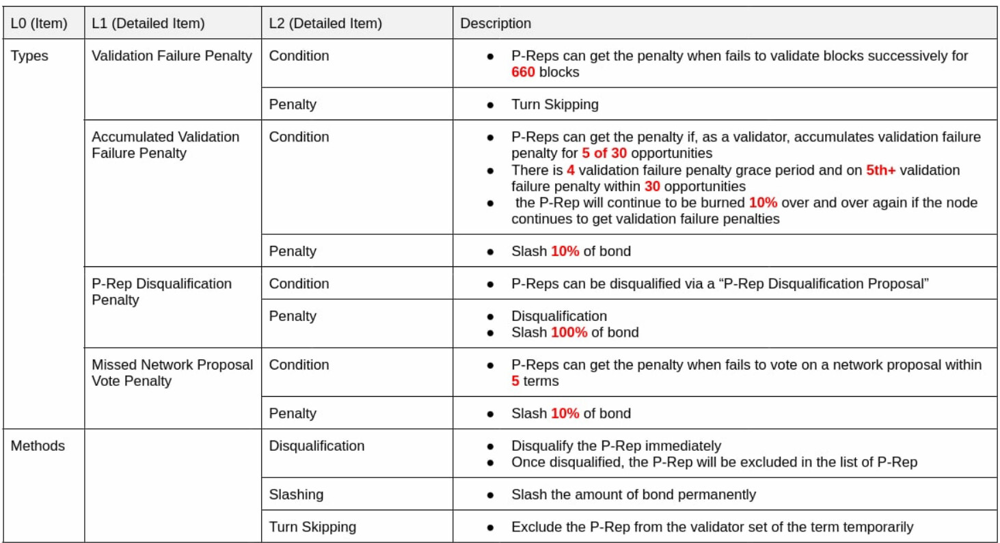

# Bond management

## How to post a bond

Posting a bond is done in 3 steps:

1. P-Rep whitelist up to 10 addresses which can post the bond. This is done using the following RPC command [#setbonderlist](json-rpc/iiss\_extension.md#setbonderlist "mention")
2. Whitelisted bonder then must stake ICX to the P-Rep using [#setstake](json-rpc/iiss\_extension.md#setstake "mention")
3. Whitelisted bonder then must post the bond to the P-Rep using [#setbond](json-rpc/iiss\_extension.md#setbond "mention")


ICONists can post a bond to up to 100 P-reps, if they are whitelisted by them

A P-Rep can only receive a bond from 10 different ICONists



You can do this using [python-sdk](../../icon-sdks/python-sdk/ "mention")`CallTransactionBuilder` or directly using goloop RPC command[iiss\_extension.md](json-rpc/iiss\_extension.md "mention").

## Penalty

IISS 3 introduced the concept of `bond` (you can see the network proposal [here](https://tracker.icon.foundation/transaction/0xcd7055153f777c3392f05c83c17e66207045f68b8504a36c07a459c706992dfe)). When a P-Rep does not behave as expected, this bond will be slashed (ICX will be burn) following those specific rules.


An **opportunity **is defined as **one term** as Main P-Rep. Therefore, **30 opportunities **means** the last 30 terms as main P-Rep **_(which can span over a longer period of time than 30 network terms)_


