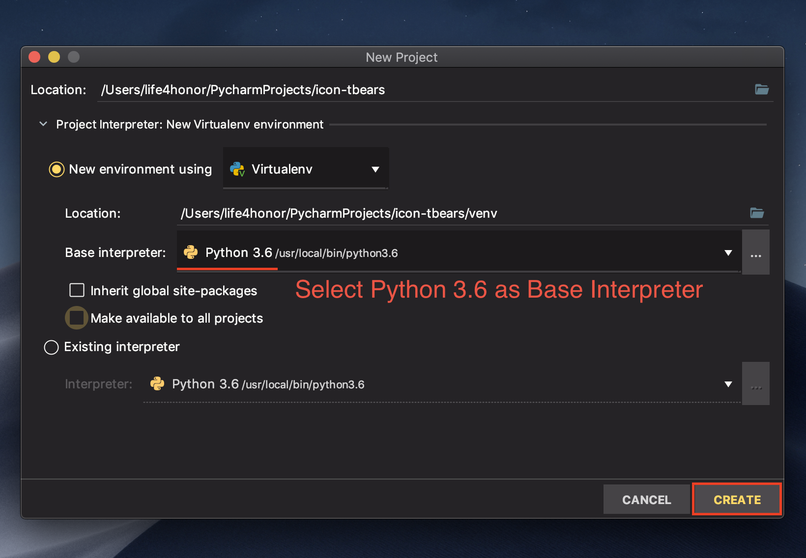
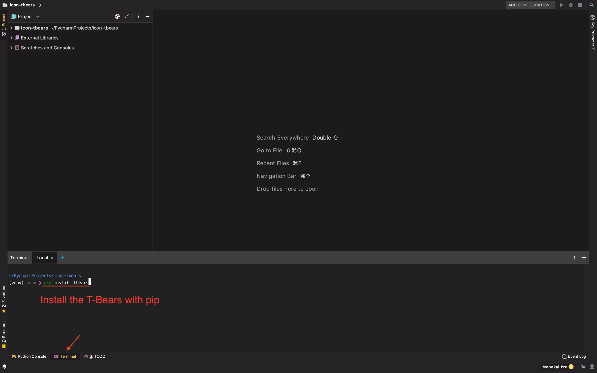
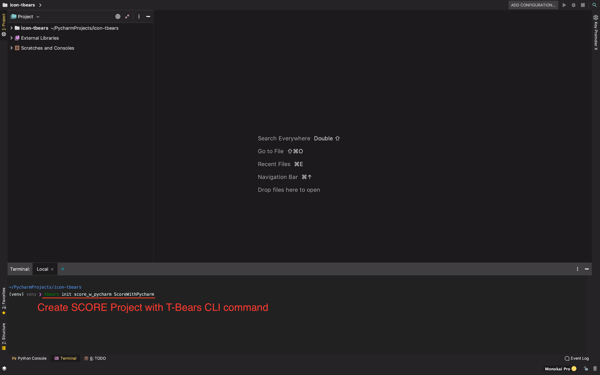
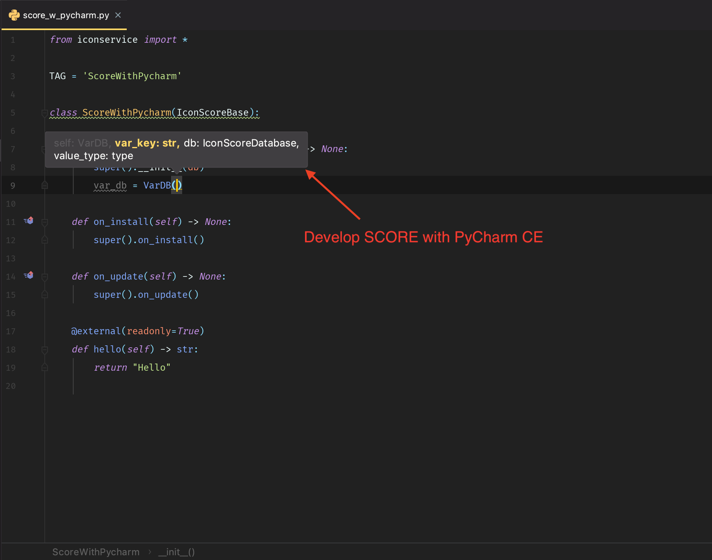

# Development Tools

## T-Bears Development Suite

Before you start writing a SCORE, you need to install the T-Bears. T-Bears provides the followings;

* Essential libraries for SCORE development, `iconservice`
* Local emulated node environment, `T-Bears Server`
* CLI commands for deploying a SCORE and invoking the SCORE functions, `T-Bears CLI`
* SCORE test framework

For the details of T-Bears, please go to [T-Bears Overview](../../tbears/overview.md)

If you have finished the [SCORE Quickstart](../quickstart/), you must have the T-Bears installed. If not, please refer to the T-Bears [Installation](../../tbears/installation.md) instruction.

## IDE - PyCharm

Because SCORE is written in Python, any IDE that supports python can be used for the SCORE development. In this document, we will explain how to set up and initialize a SCORE project in PyCharm. We assume that you are familiar with Python development.

### Install PyCharm CE, if you don't have it yet.

### Create a Python project


Currently \(as of 2019. May\), T-Bears only works on Python 3.6. When you set the base interpreter, make sure you are using Python 3.6.

* If you are using PyCharm Professional, you can configure T-Bears Docker as a remote interpreter.



### Install T-Bears using PIP

Reference: [T-Bears Installation](../../tbears/installation.md)

**Install dependencies**

On macOS \(Homebrew\)

```bash
# install develop tools
$ brew install leveldb
$ brew install autoconf automake libtool pkg-config

# install RabbitMQ and start service
$ brew install rabbitmq
$ brew services start rabbitmq
```

On Linux \(apt-get\)

```bash
# Install levelDB
$ sudo apt-get install libleveldb1 libleveldb-dev
# Install libSecp256k
$ sudo apt-get install libsecp256k1-dev

# install RabbitMQ and start service
$ sudo apt-get install rabbitmq-server
```

**Install T-Bears using pip**

```bash
pip install tbears
```



After finishing installation, you can check the T-Bears version using `tbears -v` command.


### Create a SCORE project

You can create a SCORE project using T-Bears CLI command `init`.

```bash
tbears init score_w_pycharm ScoreWithPycharm
```




### Write your code

New SCORE project has been successfully created. Select the main class file and start writing code on PyCharm.




